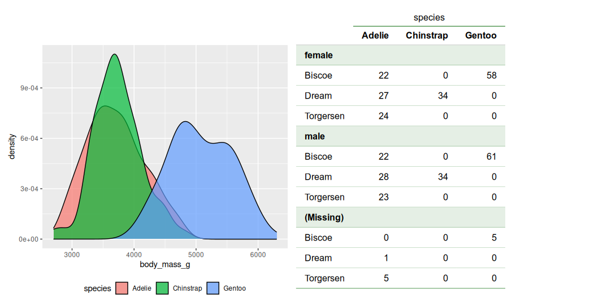

```{r, include = FALSE}
knitr::opts_chunk$set(
  collapse = TRUE,
  comment = "#>"
)
```

## Background
R has some great packages for creating nice-looking tables. Packages like `gt` and `flextable` allow the user to create a wide range of tables, with lots of flexibility in how these are presented and formatted. The downside to these Swiss army knife-style packages is that simple tasks, like creating a frequency table, require a lot of typing. Enter `ivo.table`, a package for creating great-looking frequency tables and contingency tables without any hassle.

The package offers two functions for creating tables: `ivo_table`, which uses the `flextable` framework, and `ivo_table_gt` which uses the `gt` framework. This vignette contains examples using the latter.

## A first example
Let's look at some examples using the `penguins` data from the [`palmerpenguins`](https://cran.r-project.org/package=palmerpenguins) package. Say that we want to create a contingency table showing the counts of the categorical variables `species`, `sex`, and `island`. We can use `ftable` along with `dplyr`'s `select`:

```{r example1}
library(dplyr)
library(palmerpenguins)

penguins |> select(species, sex, island) |> ftable()
```

While informative, the formatting isn't great, and it's not something that we can easily export to a report or presentation.

`ivo.table` uses the same syntax, but with `ivo_table_gt` instead of `ftable`:

```{r example2}
library(ivo.table)

penguins |> select(species, sex, island) |> ivo_table_gt()
```

You can add row and column sums:

```{r example4}
penguins |>
  select(species, sex, island) |>
  ivo_table_gt(sums = c("cols", "rows"))
```


## Changing the appearance of your tables
You can customise the look of your `ivo_table_gt` table using styling arguments and `gt` functions. You can change the colours and fonts used, highlight columns, rows or cells, make columns bold, and more. Let's look at some examples.

Change the font to Courier, use red instead of green, and make the names in the `sex` column bold:

```{r example6}
library(gt)
penguins |>
  select(species, sex, island) |>
  ivo_table_gt(color = "red",
               font_name = "Courier") |> 
  tab_style(style = list(cell_text(weight = "bold")),
                locations = cells_stub())
```

Add a caption and highlight the cell on the fourth row of the third column:

```{r example7}
penguins |>
  select(species, sex, island) |>
  ivo_table_gt(caption = "A table with penguins in it") |> 
    tab_style(style = list(cell_fill(color = "darkgreen")),
                locations = cells_body(columns = 5, rows = 4))
```

`ivo_table_gt` returns a `gt` object, meaning that all functions used to style gt tables can be used. You can also paste `ggplot2` plots and tables together using `patchwork`:
 
```{r, eval = FALSE}
library(ggplot2)
library(patchwork)

penguins_plot <- ggplot(penguins, aes(body_mass_g, fill = species)) +
                    geom_density(alpha = 0.7) +
                    theme(legend.position = "bottom")

penguins_table <- penguins |>
                    select(species, sex, island) |>
                    ivo_table_gt()

penguins_plot + penguins_table
```
 



